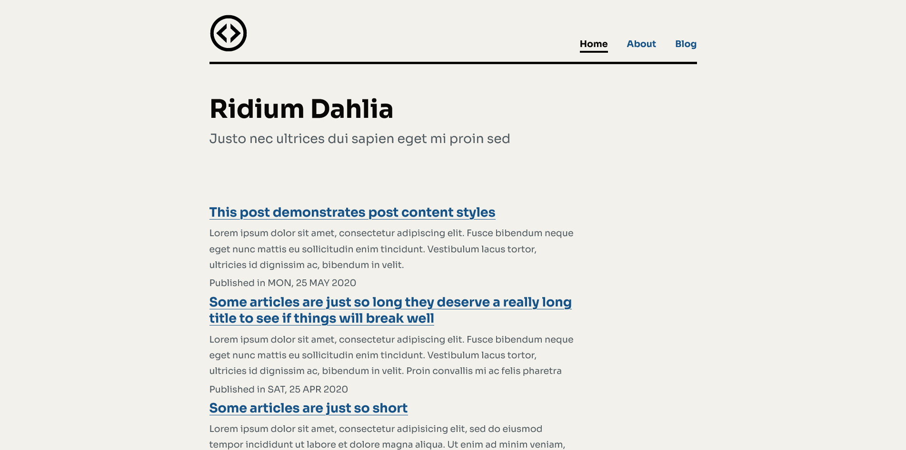

# Welcome to Astromnl Blog Template

A simple blog built using [Astro](https://astro.build)



## 🚀 Project Structure

Inside of your Astro project, you'll see the following folders and files:

```
/
├── public/
│   ├── code.png
│   └── robots.css
│   └── global.css
│   └── favicon.ico
├── src/
│   ├── posts/
│   │    └── *.md
│   ├── components/
│   │   └── Footer.astro
│   │   └── Header.astro
│   │   └── MainHead.astro
│   │   └── PostCard.astro
│   │   └── PostList.astro
│   │   └── Pagination.astro
│   ├── layouts/
│   │    └── BlogPost.astro
│   │    └── MainLayout.astro
│   ├── pages/
│       └── about.astro
│       └── contact.astro
│       └── index.astro
│       └── tags.astro
│       ├── blog/
|       |   └── [...page].astro
│       ├── post/
|       |   └── [slug].astro
│       ├── tags/
|       |   └── [tag].astro
|       |   └── [index].astro
└── package.json
```

Astro looks for `.astro` or `.md` files in the `src/pages/` directory. Each page is exposed as a route based on its file name.

There's nothing special about `src/components/`, but that's where we like to put any Astro/React/Vue/Svelte/Preact components.

Any static assets, like images, can be placed in the `public/` directory.

## 🧞 Commands

All commands are run from the root of the project, from a terminal:

| Command           | Action                                       |
| :---------------- | :------------------------------------------- |
| `npm install`     | Installs dependencies                        |
| `npm run dev`     | Starts local dev server at `localhost:3000`  |
| `npm run build`   | Build your production site to `./dist/`      |
| `npm run preview` | Preview your build locally, before deploying |

## 👀 Want to learn more?

Feel free to check [Astro documentation](https://github.com/snowpackjs/astro) or jump into our [Astro Discord server](https://astro.build/chat).

## To-Do

- [x] Add tags
- [x] Fix index page
- [x] Fix post page
- [x] Add post title
- [x] Add code styling
- [x] Add contact page
- [x] Fix navigation links
- [ ] Add pagination to tags
- [x] Change pagination styling

## Credits

This template is inspired from works the following people :

- [Aftab Alam](https://github.com/one-aalam/astro-ink)
- [Andrew Hudson](https://github.com/bigandy/astro-blog)
- [Mykal Machon](https://github.com/MykalMachon/Mykal.Codes)
- [Nikin Nagewadia](https://github.com/nnagewad/static-personal-site)
