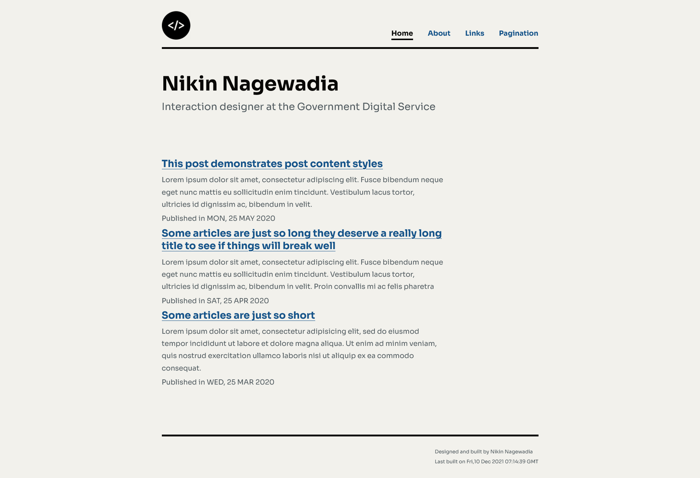

# Welcome to Astrohalfa

A simple blog template built using [Astro](https://astro.build)



## 🚀 Project Structure

Inside the Astro project, you'll see the following folders and files:

```
/
├── public/
│   ├── robots.txt
│   └── global.css
│   └── favicon.ico
├── src/
│   ├── components/
│   │   └── Footer.astro
│   │   └── Header.astro
│   │   └── MainHead.astro
│   │   └── PostCard.astro
│   │   └── PostList.astro
│   └── pages/
│       └── contact.astro
│       └── index.astro
│       └── about.astro
│       ├── posts/
|           └── [slug].astro
|           └── index.astro
│   └── posts/
│       └── *.md
└── package.json
```

Astro looks for `.astro` or `.md` files in the `src/pages/` directory. Each page is exposed as a route based on its file name.

There's nothing special about `src/components/`, but that's where we like to put any Astro/React/Vue/Svelte/Preact components.

Any static assets, like images, can be placed in the `public/` directory.

## 🧞 Commands

All commands are run from the root of the project, from a terminal:

| Command           | Action                                       |
| :---------------- | :------------------------------------------- |
| `npm install`     | Installs dependencies                        |
| `npm run dev`     | Starts local dev server at `localhost:3000`  |
| `npm run build`   | Build your production site to `./dist/`      |
| `npm run preview` | Preview your build locally, before deploying |

## 👀 Want to learn more?

Feel free to check [Astro.js Documentation](https://docs.astro.build/) or jump into the [Discord server](https://astro.build/chat).

## References

- [Stijn Cujik](https://github.com/stijnvc/holo-alfa)
- [Mykal Machon](https://github.com/MykalMachon/Mykal.Codes)

## To-Do

- [x] Fix title
- [x] Fix posts link
- [ ] Add image
- [ ] Add pagination
- [ ] Add code styling
